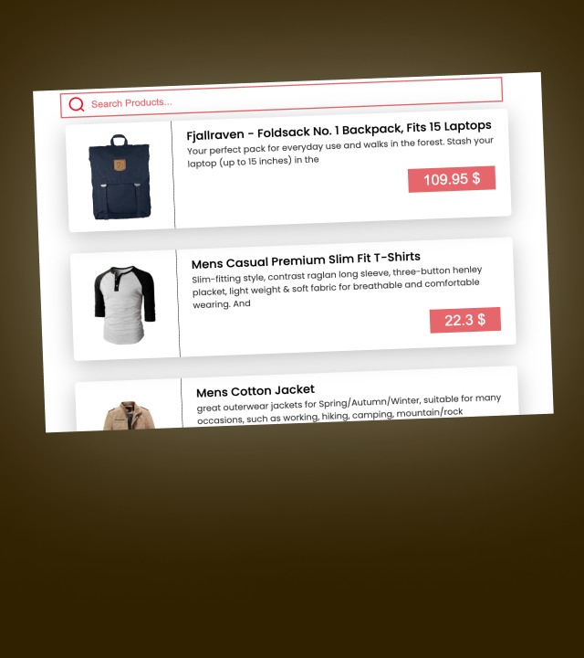

# Project-Using-HTML-CSS-JS-Products-Search-and-Filter-JS-practise-Project-
I will take figma design of this project and Made this project for practising my HTML CSS JavaScript  skills feel free to see and practise it by your own
# Product Search and Filter App

This repository contains a Product Search and Filter web application built using HTML, CSS, and JavaScript. The app fetches product data from an API (https://fakestoreapi.com/products) and allows users to search for products and apply real-time filters.

## How to Use

1. Clone the repository to your local machine.
2. Open the `index.html` file in your web browser.
3. Enter search keywords in the input field to find products that match the query in real-time.
4. The app will display products that match the search query, and you can apply additional filters such as product descriptions and prices to narrow down the results.
5. Click the "Calculate" button to calculate the total marks and the percentage.
6. The app will display the total marks obtained and the percentage on the screen.

## Styling

The app is styled using CSS with a background image. The primary font used is Poppins.

## Code Structure

The main files of the project are as follows:

- `index.html`: The HTML structure of the app.
- `style.css`: The CSS file for styling the app.
- `index.js`: The JavaScript file containing the logic for fetching product data, filtering, and displaying the results.

## Compatibility

The app should work well on modern web browsers with support for ES6 features.

Feel free to explore and modify the app to suit your requirements. Enjoy searching for products and applying real-time filters!

> **Tags:** #ProductSearch #FilterApp #WebApp #HTML #CSS #JavaScript
